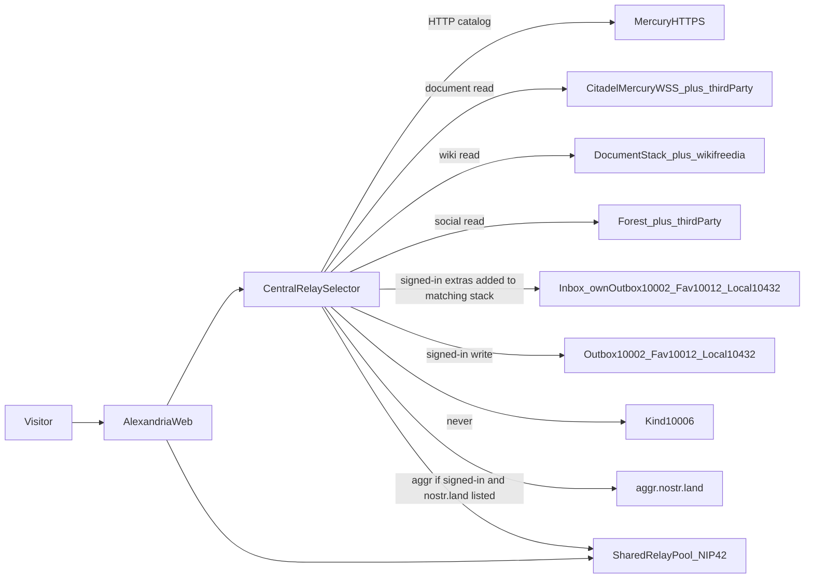

# Alexandria (gc_alexandria_2)

A new Library of Alexandria website. This repository is the **product contract**. The app is not built yet.

Acceptance tests live in [`features/`](features/). `@mvp` is the first ship. `@phase2` is deferred in [`features/phase2/deferred.feature`](features/phase2/deferred.feature). Do not extend `gc-alexandria` or `jumble`. No NDK.

Each behavior is specified once, in the feature file that owns it.

## Stack

A static TypeScript SPA (Svelte 5, Vite). No app server and no server-side event database.

The selector in [`relays/stacks.feature`](features/relays/stacks.feature) opens the matching **WebSocket** stack and reuses one pool. Mercury **HTTPS** is the catalog hop on that same selector. Identity is NIP-07 and NIP-46 via `nostr-tools` (`verifyEvent`, bech32, AUTH). Do not use NDK or `SimplePool` as the product pool.

Events and covers persist in the browser **HTTP cache and Cache Storage**, not IndexedDB. Appearance stays in `localStorage` so Clear Cache does not wipe it. Markup is AsciiDoc, Djot, and Markdown, sanitized after render.

Tests: Vitest for selector, cache, and verify; Playwright against `features/`.

## Features

| File | Covers |
|------|--------|
| [`layout/home.feature`](features/layout/home.feature) | Landing page order |
| [`layout/routes.feature`](features/layout/routes.feature) | App paths |
| [`layout/paging.feature`](features/layout/paging.feature) | Page size and caps |
| [`layout/top_bar.feature`](features/layout/top_bar.feature) | Top bar, global Nostr search on `/`, in-page filter |
| [`layout/mobile_first.feature`](features/layout/mobile_first.feature) | One layout that grows |
| [`catalog/landing_shelves.feature`](features/catalog/landing_shelves.feature) | Cover shelves, image tags, booklist and bookmark controls |
| [`catalog/landing_highlights.feature`](features/catalog/landing_highlights.feature) | Newest 9802 per edition a-tag |
| [`catalog/landing_discussing.feature`](features/catalog/landing_discussing.feature) | What we are discussing |
| [`catalog/landing_subjects.feature`](features/catalog/landing_subjects.feature) | t-tag buttons |
| [`catalog/landing_labels.feature`](features/catalog/landing_labels.feature) | Kind 1985 labels on books |
| [`catalog/search.feature`](features/catalog/search.feature) | Lookup, fan-out, progressive results, sort |
| [`catalog/errors.feature`](features/catalog/errors.feature) | Error pages for bad paths and missing or invalid events |
| [`catalog/work_editions.feature`](features/catalog/work_editions.feature) | One naddr, other copies on `/publication/d/` |
| [`catalog/dtag_normalize.feature`](features/catalog/dtag_normalize.feature) | NIP-54 slugs |
| [`catalog/card_header_metadata.feature`](features/catalog/card_header_metadata.feature) | Card and header fields |
| [`catalog/generic_card.feature`](features/catalog/generic_card.feature) | Fallback card, media dedup, nostr: embeds |
| [`catalog/picture_video_cards.feature`](features/catalog/picture_video_cards.feature) | Kind 20 and 21 |
| [`reader/read.feature`](features/reader/read.feature) | Edition page, Read this naddr, ToC, markup |
| [`reader/highlights.feature`](features/reader/highlights.feature) | Kind 9802 in the reader |
| [`wiki/articles.feature`](features/wiki/articles.feature) | Wiki versions and wikilinks |
| [`reviews/comments_threads_ratings.feature`](features/reviews/comments_threads_ratings.feature) | Kind 1111; section accordion; 34259 on publication a-tags |
| [`identity/session.feature`](features/identity/session.feature) | Anonymous browse, signer, login metadata batch |
| [`identity/profile.feature`](features/identity/profile.feature) | `/p/` and userbadges |
| [`social/mute.feature`](features/social/mute.feature) | Kind 10000 everywhere, read-only in the app |
| [`security/sanitize_verify.feature`](features/security/sanitize_verify.feature) | Sanitize and signatures |
| [`cache/client_cache.feature`](features/cache/client_cache.feature) | HTTP cache and Cache Storage, local publish, login batch, kind 5 |
| [`appearance/settings.feature`](features/appearance/settings.feature) | Schemes, colors, fonts |
| [`site/about_start_contact.feature`](features/site/about_start_contact.feature) | About, Start, Contact |
| [`relays/stacks.feature`](features/relays/stacks.feature) | Selector, pool, AUTH |
| [`performance/nostr_opacity.feature`](features/performance/nostr_opacity.feature) | Library language, protocol details opt-in |
| [`phase2/deferred.feature`](features/phase2/deferred.feature) | Later surfaces |

## Related repos

- `gc-alexandria` — current Alexandria site (palettes, About/Contact)
- `gc_index_relay` — Mercury catalog HTTP API
- `jumble` — Imwald web client (library search, booklists)
- `imwald-android` — companion Android app
